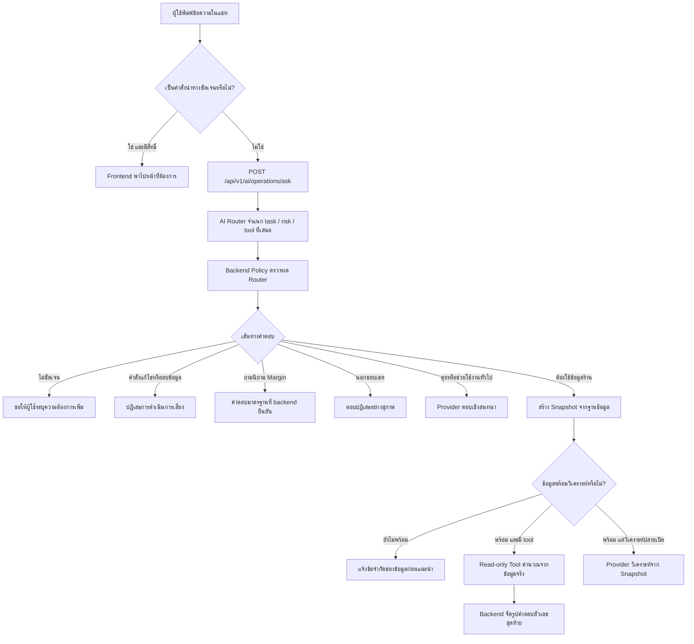
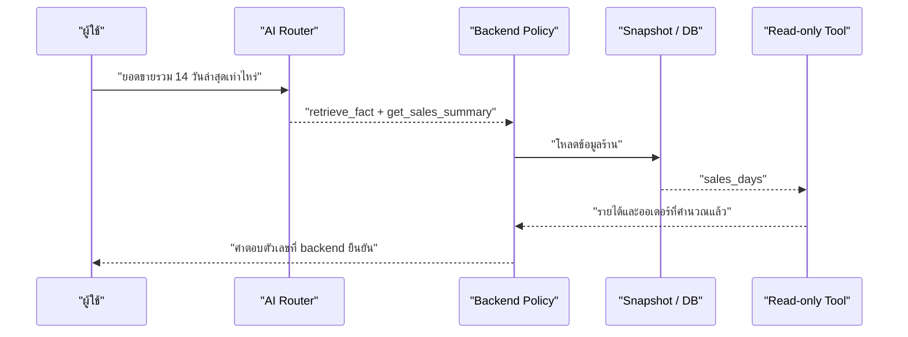

# Restaurant Management AI Agent

> ผู้ช่วยสำหรับเจ้าของร้านที่เข้าใจคำถามภาษาไทย ช่วยอ่านข้อมูลร้านอย่างปลอดภัย และพาไปยังหน้าที่ต้องใช้งานได้โดยไม่ทำรายการเสี่ยงแทนผู้ใช้

## ภาพรวมสั้น ๆ

AI Agent ของระบบไม่ได้เป็นเพียงแชทบอตที่ส่งทุกคำถามไปให้โมเดลตอบเอง แต่เป็นระบบที่แบ่งหน้าที่ชัดเจน:

| ส่วนประกอบ | หน้าที่ |
| --- | --- |
| AI Router | อ่านคำถามล่าสุด แล้วจำแนกว่าเป็นการคุยทั่วไป, ถามข้อมูลจริง, ขอคำแนะนำ, ขอใช้งานระบบ, คำสั่งเสี่ยง หรือนอกขอบเขต |
| Backend Policy | ตรวจผลจาก Router อีกครั้งก่อนอนุญาตให้โหลดข้อมูลหรือเรียก tool |
| Read-only Tools | อ่านและสรุปข้อมูลจริงจาก snapshot ของร้าน โดยไม่แก้ไขข้อมูล |
| Response Flow | เลือกว่าจะให้ provider ช่วยเรียบเรียงภาษา หรือให้ backend ตอบข้อเท็จจริงแบบแน่นอน |
| Frontend Navigation | ตรวจคำสั่งพาไปหน้า, สิทธิ์ผู้ใช้ และนำทางบนเว็บ |

หลักสำคัญคือ **AI ช่วยเข้าใจความต้องการ แต่ backend เป็นผู้คุมสิทธิ์และข้อเท็จจริงทางธุรกิจ**

## Flow การทำงาน

## Agent เข้าใจงานประเภทใดบ้าง

| Task | ตัวอย่างคำถาม | แนวทางทำงาน |
| --- | --- | --- |
| `general_chat` | `สวัสดี` | ตอบสนทนาโดย provider |
| `scope_question` | `นายช่วยอะไรได้บ้าง` | อธิบายขอบเขตผู้ช่วย |
| `explain_concept` | `มาร์จิ้นคืออะไร` | Router เลือก task แล้ว backend ตอบคำนิยามมาตรฐาน |
| `retrieve_fact` | `เมนูไหนมี Margin ต่ำที่สุด` | โหลดข้อมูลร้านและใช้ tool ที่ตรงคำถาม |
| `analyze_data` | `ช่วยวิเคราะห์ยอดขายช่วงนี้` | ส่ง snapshot ที่มี guardrail ให้ provider วิเคราะห์ |
| `recommend_action` | `จากข้อมูลร้านควรซื้อวัตถุดิบอะไรเพิ่ม` | โหลดข้อมูลและตรวจ readiness ก่อนให้คำแนะนำ |
| `restaurant_advice` | `มีไอเดียโปรโมทร้านช่วงฝนตกไหม` | ให้คำแนะนำทั่วไปโดยไม่อ้างข้อมูลร้านจริง |
| `restaurant_content` | `ช่วยเขียนแคปชั่นโปรโมทเมนูใหม่` | สร้างข้อความสำหรับร้าน |
| `product_help` | `เพิ่มเมนูในระบบทำยังไง` | ช่วยอธิบายการใช้งานระบบ |
| `risky_action` | `ลบเมนูนี้ให้ที` | บล็อก ไม่แก้ข้อมูลผ่านแชท |
| `out_of_scope` | `ช่วยแต่งกลอนความรัก` | ควรปฏิเสธและชวนกลับสู่งานร้าน |
| `unclear` | `rytyt` | ขอคำถามที่ชัดขึ้น |

## Tools ข้อมูลร้านที่มีอยู่จริง

Tools ด้านล่างเป็น **read-only tools**: ใช้อ่าน/คำนวณผลจากข้อมูลร้านเท่านั้น ไม่มีตัวใดเพิ่ม แก้ หรือลบข้อมูลในฐานข้อมูล

| Tool | ผู้ใช้ถามประมาณไหน | ข้อมูลที่ตอบได้ |
| --- | --- | --- |
| `get_lowest_margin_menu` | `เมนูไหนมี Margin ต่ำที่สุด` | เมนูที่ Margin ต่ำสุด, จำนวนขาย, รายได้, ต้นทุน, กำไร, Margin และค่าเฉลี่ยต่อจาน |
| `get_low_stock_ingredients` | `วัตถุดิบอะไรใกล้หมด` | วัตถุดิบใกล้หมด/หมด, คงเหลือ, เกณฑ์ขั้นต่ำ และปริมาณแนะนำให้ตรวจเติม |
| `get_top_selling_menus` | `เมนูอะไรขายดีที่สุด` | อันดับเมนูขายดี, จำนวนจาน และรายได้ |
| `get_inventory_valuation` | `มูลค่าคลังตอนนี้เท่าไหร่` | จำนวนรายการวัตถุดิบ, รายการหมด/ใกล้หมด และมูลค่าคลังรวม |
| `get_sales_summary` | `ยอดขายรวม 14 วันล่าสุดเท่าไหร่` | รายได้รวม, จำนวนออเดอร์รวม และจำนวนวันที่มีรายการขาย |

### ทำไมต้องให้ backend ตอบผล Tool

สำหรับคำถามที่มีตัวเลขจริง ระบบให้ Router เลือก tool แต่ให้ backend เป็นผู้จัดรูปคำตอบสุดท้ายจากผลคำนวณ เพื่อป้องกันกรณีโมเดลเขียนยอดขาย, ต้นทุน หรือ Margin ผิดจากข้อมูลจริง

## การพาไปหน้าในเว็บ

การนำทางทำที่ frontend ก่อนส่งคำถามไป backend เมื่อผู้ใช้สั่งชัดเจน เช่น `พาไปหน้าเมนู` หรือ `เปิดหน้าตั้งค่า` ระบบจะ:

1. ตรวจว่ามีคำสั่งนำทางจริง ไม่พาไปเองจากคำว่า `เมนู` เพียงคำเดียว
2. เทียบชื่อหน้าจากคำไทย/อังกฤษที่รองรับ
3. ตรวจ permission ของสมาชิกก่อนเปิดหน้า
4. หากพบหลายหน้าที่ใกล้เคียง ให้ผู้ใช้เลือกแทนการเดา

หน้าที่รองรับการนำทางในปัจจุบัน:

| กลุ่ม | หน้า |
| --- | --- |
| งานประจำร้าน | ภาพรวม, รับออเดอร์, จอครัว, เมนูอาหาร, ผังโต๊ะ, คลังออเดอร์, คลังวัตถุดิบ |
| วิเคราะห์และผู้ช่วย | AI ผู้ช่วย, รายงาน |
| การจัดการ | พนักงาน, ตั้งค่า, บัญชีของฉัน, ภาษาและการแสดงผล, ข้อมูลร้านและการคิดเงิน, ทีมและสิทธิ์ |

นอกจากคำสั่งนำทางโดยตรง คำตอบ AI ยังสามารถเสนอปุ่มช่วยดำเนินการ เช่น `ตรวจรายการในคลัง`, `เปิดหน้าเมนูเพื่อตรวจสอบ`, `เปิดการตั้งค่าร้าน` และ `ดูรายงานเต็ม` โดยบางปุ่มต้องกดยืนยันก่อนเปลี่ยนหน้า

## Provider ที่รองรับ

| Provider | บทบาท |
| --- | --- |
| Groq | ใช้เป็น Router และตอบสนทนา/วิเคราะห์ผ่าน API |
| Gemini | ใช้เป็น Router และตอบสนทนา/วิเคราะห์ผ่าน API |
| Ollama | ใช้ Local LLM สำหรับ Router และการตอบบนเครื่องผู้พัฒนา |
| `auto` | ลอง Groq, Gemini แล้วจึง Ollama ตามลำดับ |

สำหรับ Ollama ระบบส่ง `think = false` และใช้ context เริ่มต้น `4096` เพื่อให้ตอบบนเว็บเร็วขึ้น โดยปรับค่าได้ผ่าน `OLLAMA_CONTEXT_LENGTH`

## Guardrails ที่มีแล้ว

| ความเสี่ยง | การป้องกันปัจจุบัน |
| --- | --- |
| Router เสนอ task/tool ที่ระบบไม่รู้จัก | Backend ปฏิเสธผลลัพธ์นั้น |
| ความมั่นใจของ Router ต่ำ | ตอบขอรายละเอียดเพิ่มแทนการเดา |
| ผู้ใช้สั่งลบ/แก้ข้อมูล/สั่งซื้อผ่านแชท | Safety guard บล็อกการดำเนินการ |
| ข้อมูลต้นทุนหรือสูตรเมนูไม่ครบ | Readiness guardrail แจ้งข้อจำกัดก่อนสรุป/แนะนำ |
| โมเดลอาจแต่งตัวเลขหลัง tool ทำงาน | Fact tools ให้ backend เป็นผู้เขียนคำตอบสุดท้าย |
| ผู้ใช้พิมพ์ชื่อหน้าโดยไม่ได้ขอให้พาไป | Frontend ไม่ navigate อัตโนมัติ |

## สถานะปัจจุบัน

### สิ่งที่ทำได้ดีแล้ว

- Router สามารถเลือก tool ข้อมูลจริง 5 ตัว และ backend คุมผลตัวเลขได้
- คำถาม `มาร์จิ้นคืออะไร` แยกจากคำถามข้อมูลร้าน ไม่โหลด snapshot โดยไม่จำเป็น
- คำสั่งเสี่ยงถูกบล็อก และการแนะนำจากข้อมูลร้านผ่าน readiness guardrail
- การพาไปหน้าเว็บตรวจคำสั่งและสิทธิ์ก่อนนำทาง
- รองรับ provider ทั้ง API และ Local LLM

### จุดที่กำลังพัฒนาต่อ

- Router ยังอาจจัดคำขอนอกขอบเขตบางแบบไม่สม่ำเสมอ เช่น คำขอแต่งกลอน
- คำตอบจาก tool ยังไม่มีโหมด `ตอบสั้น ๆ` สำหรับคำแนะนำวัตถุดิบ ทำให้ตอบละเอียดเกินคำขอได้
- บุคลิกและภาษาของคำตอบสนทนา/ปฏิเสธยังขึ้นกับ provider จึงยังควรเพิ่ม response policy

## ไฟล์หลักที่เกี่ยวข้อง

| ไฟล์ | หน้าที่ |
| --- | --- |
| `backend/internal/service/ai_service.go` | เส้นทางหลักของ Router, provider, snapshot, guardrail และคำตอบ |
| `backend/internal/service/ai_tasks.go` | task contract, backend policy, read-only tools และตัวจัดรูปคำตอบ fact |
| `backend/internal/controller/ai_api_eval_test.go` | live API journey tests เสมือนผู้ใช้บนเว็บ |
| `frontend/src/lib/aiNavigation.ts` | ตรวจคำสั่งพาไปหน้าและ permission |
| `frontend/src/lib/aiGuidedActions.ts` | ปุ่มแนะนำหลัง AI ตอบ |
| `frontend/src/components/shared/AIOperationsFloatingChat.tsx` | หน้าต่างแชทและการเชื่อม flow ฝั่งเว็บ |
| `AI_AGENT_BEHAVIOR_TESTING.md` | แผนและผลทดสอบพฤติกรรม Agent |

## แนวทางถัดไปที่แนะนำ

1. ทำให้ `out_of_scope` เสถียรขึ้นด้วย Router evaluation cases และ scope policy ที่วัดซ้ำได้
2. เพิ่ม `response_style` เช่น `brief` / `normal` ให้ Router ส่งมา เพื่อให้ backend formatter ตอบตามคำว่า `ตอบสั้น ๆ`
3. ขยาย tool สำหรับคำถามเจ้าของร้านที่ใช้บ่อย เช่น ยอดขายรายวัน, เมนูกำไรสูง และแนวโน้มวัตถุดิบที่ถูกใช้เร็ว
4. ใช้ live user journey test เป็นเกณฑ์ก่อนเปลี่ยน provider หรือ prompt ทุกครั้ง

