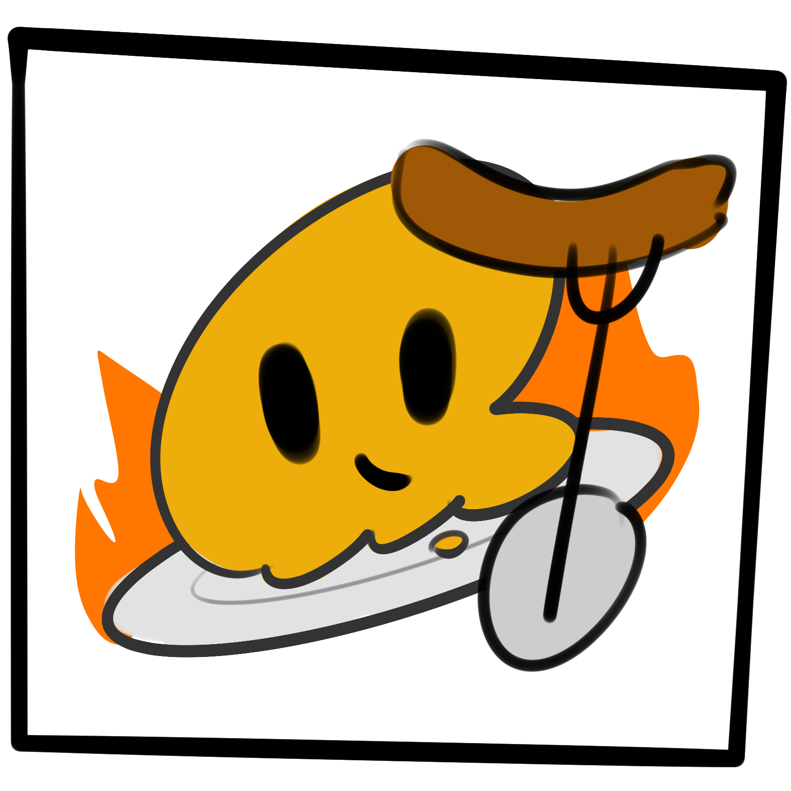
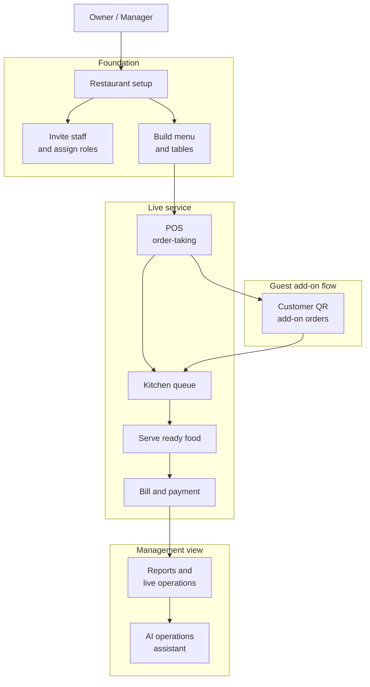
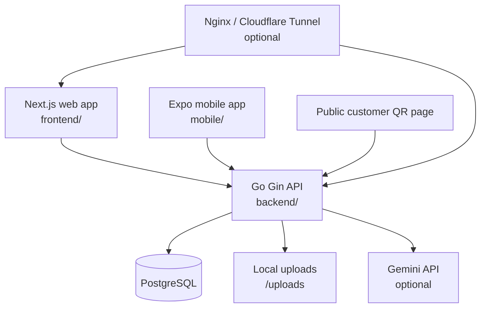

<div align="center">
  

  <h1>Restaurant Hub</h1>

  <p>
    <strong>An operational restaurant management system for Thai restaurant shift work.</strong>
  </p>

  <p>
    Restaurant Hub helps owners, waiters, cashiers, chefs, and managers run the floor, kitchen, billing, staff, menu, tables, inventory, and live operations from one focused workspace.
  </p>

  <p>
    
    
    
    
    
  </p>
</div>

## Overview

Restaurant Hub is a pre-capstone fullstack project built around real restaurant operations rather than generic dashboard screens. The system supports restaurant onboarding, staff access control, menu and table setup, order-taking, kitchen display flow, billing, payment snapshots, ingredient inventory, customer QR ordering, reports, and an optional AI operations assistant.

The product direction is simple: make active shift work faster, clearer, and less error-prone across desktop, tablet, and mobile screens.

## Highlights

| Area | What it supports |
| --- | --- |
| Restaurant setup | Multi-restaurant selection, onboarding, restaurant profile, opening hours, service charge, VAT, PromptPay settings |
| Authentication | Email/password auth, Google login, JWT sessions, password reset, auth rate limits |
| Staff operations | Invitations, restaurant-scoped memberships, system roles, custom roles, permission management |
| Menu management | Categories, menu items, image upload, availability, option groups, option price deltas |
| Table management | Zones, reusable tags, generated labels, bulk creation, status updates, customer QR token regeneration |
| POS | Table picker, dine-in and takeaway orders, menu option selection, item notes, send to kitchen, serve ready food |
| Kitchen display | Active kitchen queue, kitchen batches, item status updates, mark-all-ready, new-ticket sound |
| Billing and payment | Bill view, cash payment, static PromptPay QR payment, service charge/VAT snapshots, printable bill |
| Customer QR ordering | Public per-table ordering links that add customer rounds to staff-opened table orders |
| Live operations | `/home` command center with active tables, kitchen signals, revenue rhythm, and top item summaries |
| Inventory | Ingredient categories, stock levels, low-stock signals, adjustments, transaction history |
| AI assistant | Optional Gemini-backed operations assistant using bounded restaurant snapshots |
| Mobile app | Expo app for core staff/owner workflows against the same Go API |

## Product Workflow



## Tech Stack

| Layer | Stack |
| --- | --- |
| Web frontend | Next.js 16 App Router, React 19, TypeScript, Tailwind CSS v4, Recharts |
| Backend API | Go 1.24, Gin, GORM |
| Database | PostgreSQL 16 |
| Mobile | Expo 54, React Native 0.81, Expo Router |
| Auth | JWT, Google Identity Services, restaurant-scoped authorization |
| AI | Gemini API through the Go backend |
| Deployment helpers | Docker Compose, Nginx, PgBouncer, Cloudflare Tunnel scripts |

## Architecture



Backend data is scoped by restaurant with `X-Restaurant-ID`. The backend owns permission checks, restaurant scoping, order state transitions, table status synchronization, billing snapshots, and inventory writes.

## Repository Structure

```text
.
|-- backend/             # Go API, Gin routes, GORM entities, services, repositories
|-- frontend/            # Next.js web app and dashboard surfaces
|-- mobile/              # Expo React Native app
|-- infra/               # Nginx, PgBouncer, PostgreSQL config
|-- scripts/             # Public tunnel helpers
|-- docs/                # Local project documentation and wiki
|-- PRODUCT.md           # Product direction and audience
|-- DESIGN.md            # Visual system and UX principles
`-- docker-compose.yml   # PostgreSQL, PgBouncer, scalable backend, Nginx stack
```

## Getting Started

### Prerequisites

- Go 1.24+
- Node.js 20+
- npm
- PostgreSQL 16, or Docker Desktop for the included PostgreSQL service

### 1. Install dependencies

```powershell
cd backend
go mod download

cd ../frontend
npm install

cd ../mobile
npm install
```

### 2. Start PostgreSQL

Using the included Compose file:

```powershell
docker compose up -d postgres
```

This exposes PostgreSQL on host port `5433` to avoid clashing with a local PostgreSQL installation.

### 3. Configure the backend

Create `backend/.env`:

```env
DB_HOST=localhost
DB_PORT=5433
DB_USER=postgres
DB_PASSWORD=your-local-postgres-password
DB_NAME=Project_M

JWT_SECRET=change-this-to-a-secure-random-string-at-least-32-characters

SERVER_HOST=localhost
SERVER_PORT=8080
FRONTEND_URL=http://localhost:3000
CORS_ALLOWED_ORIGINS=http://localhost:3000

GOOGLE_CLIENT_ID=
GEMINI_API_KEY=
GEMINI_MODEL=gemini-2.5-flash

SMTP_HOST=<smtp-host>
SMTP_PORT=587
SMTP_FROM=<sender-email>
SMTP_USER=<smtp-username>
SMTP_PASSWORD=<smtp-app-password>
```

The SMTP values enable the forgot-password email flow. Keep the real credentials only in the ignored `backend/.env` file or the deployment platform's secret store. `FRONTEND_URL` is used to build the one-hour reset link, so it must point to the public web origin in production. The public endpoint always returns a generic response and never writes an email address, reset token, or reset link to logs.

Then run the API:

```powershell
powershell -NoProfile -ExecutionPolicy Bypass -File .\scripts\start-backend.ps1
```

The backend runs on `http://localhost:8080` and exposes `GET /health`.

### 4. Configure the web app

Create `frontend/.env.local`:

```env
NEXT_PUBLIC_API_URL=http://localhost:8080
NEXT_PUBLIC_GOOGLE_CLIENT_ID=
```

Then run the frontend:

```powershell
cd frontend
npm.cmd run dev
```

Open `http://localhost:3000`.

After both environment files are configured, you can start the backend and frontend together from the repository root:

```powershell
powershell -NoProfile -ExecutionPolicy Bypass -File .\scripts\start-local.ps1
```

Managed runtime commands create new timestamped stdout and stderr files directly under `logs/<service>/current/`. They never move, rename, append to, or overwrite an older run. Move old files to `archive/` manually whenever you want to tidy them.

### 5. Run the mobile app

Create a mobile environment value for the API URL:

```env
EXPO_PUBLIC_API_URL=http://localhost:8080
```

Then start Expo:

```powershell
cd mobile
npm.cmd start
```

For physical-device testing, use a LAN-accessible backend URL or the included backend tunnel helper.

## Useful Commands

| Command | Location | Purpose |
| --- | --- | --- |
| `powershell -File .\scripts\start-backend.ps1` | Repository root | Start the Go API from source with automatic runtime logs |
| `go test ./...` | `backend/` | Run backend tests |
| `powershell -File .\scripts\start-local.ps1` | Repository root | Start the local Go API and Next.js app together |
| `npm.cmd run dev` | `frontend/` | Start the local Next.js app with automatic runtime logs |
| `npm.cmd run lint` | `frontend/` | Run ESLint |
| `npm.cmd run build` | `frontend/` | Build the production frontend |
| `npm.cmd run test:agent` | `frontend/` | Run frontend Vitest checks |
| `npm.cmd start` | `mobile/` | Start Expo |
| `npm.cmd run typecheck` | `mobile/` | Type-check the mobile app |

## Public Tunnel Mode

The repo includes scripts for serving the local app through the configured Cloudflare public domain.

```powershell
powershell -NoProfile -ExecutionPolicy Bypass -File .\scripts\start-backend.ps1 -Mode public
```

```powershell
cd frontend
npm.cmd run build:public
npm.cmd run start:public
```

```powershell
cd frontend
npm.cmd run tunnel:public
```

Public routes:

- Web app: `https://dishy.pro`
- API: `https://api.dishy.pro`

The persistent public frontend uses `next start` to keep Node memory low. It has no Hot Reload, so after every frontend source change run `build:public` and restart `start:public` before checking `dishy.pro`, even for a small visual edit. Local `npm.cmd run dev` still uses Hot Reload and only needs full builds at meaningful checkpoints. For a short public editing session that explicitly needs Hot Reload, use `npm.cmd run dev:public` instead.

## API Surface

Most private routes live under `/api/v1`, require `Authorization`, and use `X-Restaurant-ID` for restaurant scoping.

| Domain | Main routes |
| --- | --- |
| Auth | `POST /api/login`, `POST /api/register`, `POST /api/google-login`, `POST /api/forgot-password`, `POST /api/reset-password` |
| Restaurants | `/api/v1/restaurants`, `/api/v1/restaurants/me`, members, invitations, audit logs |
| Roles | `/api/v1/roles`, role permissions, custom role CRUD |
| Menu | `/api/v1/categories`, `/api/v1/menu-items`, menu image upload, availability |
| Tables | `/api/v1/tables`, zones, tags, bulk create, customer token regeneration |
| Orders | `/api/v1/orders`, items, kitchen send, cancel, close, bill, pay |
| Kitchen | `GET /api/v1/kitchen/queue` |
| Inventory | `/api/v1/ingredient-categories`, `/api/v1/ingredients`, adjustments, transactions |
| Reports | `GET /api/v1/reports/manager` |
| AI | `GET /api/v1/ai/operations/snapshot`, `POST /api/v1/ai/operations/ask` |
| Public customer ordering | `GET /api/public/table-orders/:token`, `POST /api/public/table-orders/:token/submit` |

## Design Direction

Restaurant Hub is designed as a shift console:

- Calm, dense, operational UI instead of decorative SaaS marketing patterns.
- Thai and English interface support with Kanit typography.
- Neutral surfaces, small-radius components, dark primary actions, and orange as a restrained brand accent.
- Status colors only when they represent real operational state.
- Mobile-first handling for POS, staff, kitchen, and customer-facing flows.

## Current Limitations

The project intentionally keeps several larger features out of the current MVP:

- No payment gateway or automatic PromptPay confirmation.
- No split bills, refunds, or full tax invoice numbering.
- Web POS/KDS realtime uses SSE on the current single backend process; cross-instance fan-out and mobile SSE are not yet implemented.
- Inventory is ingredient-focused; full recipe costing and automatic stock deduction are still in progress.
- Mobile app does not yet cover every web-only workflow such as inventory, reports, AI assistant, and receipt printing.

## Quality Gates

Before treating a substantial change as complete:

```powershell
cd backend
go test ./...
```

```powershell
cd frontend
npm.cmd run lint
npm.cmd run build
```

Mobile changes should also run:

```powershell
cd mobile
npm.cmd run typecheck
```

## Project Status

Restaurant Hub is an active pre-capstone project. The current MVP can run the core restaurant loop from setup to order-taking, kitchen flow, served orders, bill/payment, and live operations review.
